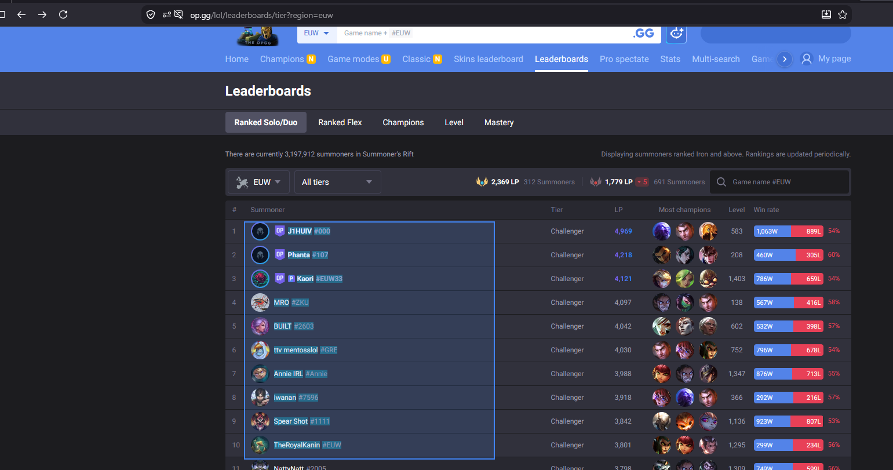
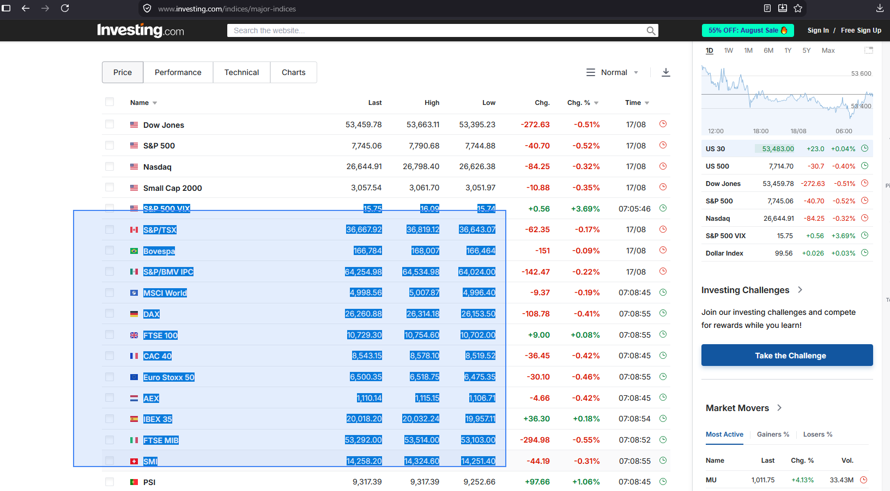

# Rectangle Text Selection

A Firefox extension that lets you select text within a rectangular area of a webpage instead of selecting it line by line.

Useful for selecting columns from tables, multi-column layouts, code, and other content where standard text selection is inconvenient.

Install at https://addons.mozilla.org/en-US/firefox/addon/rectangle-selection/

## Demo Images

## Features
Rectangle selection — Select text by dragging over a rectangular area of a webpage.

Character or word selection — Toggle between selecting individual characters and full words, depending on the content.

Selection while scrolling — Continue extending a selection while scrolling through the page, allowing you to select content that doesn't fit on screen.

Performance optimizations — Uses a cached set of text nodes and their positions to avoid repeatedly calculating text geometry, allowing the extension to work on pages containing large amounts of text.

## How to use
Enable Rectangle Text Selection using the extension button or Alt+Shift+R.
Hold Shift and drag over the area you want to select.
Release Shift to finish the selection.
Copy the selected text normally with Ctrl+C.

The selection mode can be switched between character-level and word-level selection from the extension popup.

## Why?

Normal browser text selection follows the structure of the document. This can make selecting vertically aligned text difficult, particularly on pages containing multiple columns.

Rectangle selection allows you to select based on the visual position of text rather than its document structure.

## Building

Install the dependencies and run the build script:

npm install

npm run build

The resulting extension package can be loaded into Firefox as a temporary add-on from about:debugging.

Built on Windows 10 with node v18.15.0, but it should work on any platform.

The extension is built at "rectangle_select_release.zip". As an intermediary step, a "dist" folder is also created, containing the same files as the zip.

## Project structure
manifest.json — Extension manifest

src/content — Rectangle selection and text-processing logic

src/popup — Extension UI
## Contributing

Contributions and improvements are welcome. Please open an issue to discuss changes, suggestions or bugs.

## License

This project is licensed under the Mozilla Public License 2.0 (MPL-2.0).
